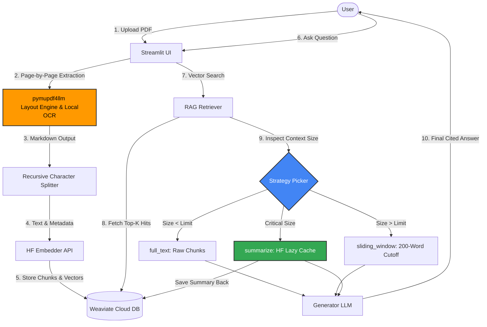

# RAG Knowledge Assistant

The app ingests documents, stores chunk embeddings in Weaviate Cloud, and answers natural-language questions with Retrieval-Augmented Generation (RAG).

---

## Features
- **Drag-and-drop uploads** – Add one or more PDFs in the Streamlit sidebar. 
- **Layout-Aware Parsing & Local OCR** – Natively handles complex multi-column layouts and Markdown tables, and automatically runs local Hybrid OCR on scanned or image-only PDFs.
- **Automatic chunking & embeddings** – 512-token chunks with overlap, embedded via Hugging Face API. 
- **Adaptive context** – Automatically selects full-text, sliding-window, or lazy summary on the fly based on retrieval data payload size. 
- **Lazy summary cache** – Initial retrieval triggers a one-off document chunk summary call; the output is securely cached back into Weaviate to protect external API rate limits. 
- **Cited answers** – Source file names and page numbers are dynamically cited alongside every generation.
- **Local privacy** – Source text extractions, local OCR processing, and document text partitioning run fully locally inside your environment.

---

## High-level architecture



---

## Setting Up

### 1. Prerequisites
| Tool | Version | Notes |
|------|---------|-------|
| Python | 3.10+ | Tested on 3.12 |
| WSL 2 | Latest | **Required on Windows** (due to upstream ONNX Runtime layout engine requirements) |

### 2. Clone & install (Run inside WSL 2)
Open your WSL 2 terminal and execute the following:

```bash
git clone [https://github.com/TheOne969/rag_qna.git](https://github.com/TheOne969/rag_qna.git)
cd rag_qna
python3 -m venv .venv && source .venv/bin/activate
pip install -r requirements.txt
```

### 3. Set environment variables
Create a configuration file named `.env` in the repository root directory:

```text
HUGGINGFACE_API_KEY=<your-hf-token>
WEAVIATE_URL=<your-wcd-cluster-url>
WEAVIATE_API_KEY=<your-wcd-admin-api-key>
```

### 4. Launch the frontend
Because the application runs natively out of a WSL 2 environment, built-in file watchers and cross-origin controls can cause browser reload loops. Launch the application using the following exact configuration flags to secure your server connection:

```bash
streamlit run app.py --server.fileWatcherType=none --server.headless=true --server.enableCORS=false --server.enableXsrfProtection=false
```

Once initialized, manually navigate to `http://localhost:8501` inside your Windows browser window.

---

## Usage guide

<mark>**NEW!**</mark> The extraction pipeline features a local layout engine and asynchronous OCR. It smoothly ingests multi-column literature, raw data matrix charts, and scanned text layouts. 

| Action | Where | Result |
|--------|-------|--------|
| **Ingest PDF** | Sidebar → *Ingest* | Document layout is parsed → OCR text patched → chunked → stored; duplicates skipped. |
| **Ask question** | Main panel | Retrieves optimal top-k semantic nodes, targets strategy, generates response. |
| **Delete collection**| `python weaviate_delete_collection.py` | Drops target vectors in cloud schema for a clean runtime wipe. |

---

## Repository layout
```text
rag_qna/
├── app.py                      # Streamlit frontend application
├── main.py                     # CLI pipeline test script
├── chunking.py                 # Recursive context splitter
├── pdf_extraction.py           # Layout-aware loader & Local OCR engine
├── summarizer.py               # HF summariser framework + lazy cache logic
├── generator.py                # Text-generation client abstraction 
├── rag.py                      # Vector search & database retrieval engine
├── weaviate_handler.py         # Collection mutation helpers
├── start_weaviate.sh           # Convenience local docker script
├── requirements.txt            # System dependencies manifest
└── README.md                   # Documentation
```

---

## Future Upgrades 

- **Advanced Chunking Strategies:** Implement Semantic Chunking (leveraging sentence-similarity token distributions over mechanical character thresholds) to guarantee core topical concepts are never parsed across splits.
- **UI Streaming:** Implement token-by-token asynchronous streaming to lower perceived generation latency and optimize User Experience (UX).